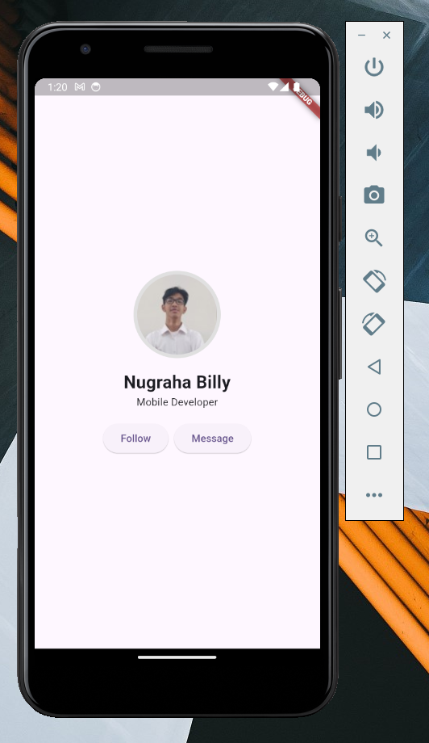

## Case Study 1: Simple Profile Page



<br>

**Description:**  
Create a profile page that displays a profile picture, name, and brief description. This page should also include two action buttons underneath the profile information.

**Implementation:**

- **`Column`**: Used to organize the profile elements vertically.
- **`Stack`**: Utilized to position the profile picture with a circular background.
- **`Row`**: Used to arrange two action buttons horizontally at the bottom.

<br>

**Code Fragments (Easy) 🧩**

```dart
import 'package:flutter/material.dart';

class CaseStudy1 extends StatelessWidget {
  const CaseStudy1({super.key});

  @override
  Widget build(BuildContext context) {
    return Column(
      mainAxisAlignment: MainAxisAlignment.center,
      crossAxisAlignment: CrossAxisAlignment.center,
      children: [
        // TODO: Add a Stack here to build the profile image with a border effect
        // TODO: Add Text widgets for the name and role
        // TODO: Add a Row for action buttons (Follow and Message)
      ],
    );
  }
}
```

```dart
Stack(
  alignment: Alignment.center,
  children: [
    CircleAvatar(
      radius: 60,
      backgroundColor: Colors.grey[300],
    ),
    // TODO: Add a CircleAvatar here to build the profile image
  ],
),
```

```dart
const CircleAvatar(
    radius: 55,
    backgroundImage: NetworkImage('your-profile-picture-url'),
),
```

```dart
const SizedBox(height: 16),
const Text(
  'Your Name',
  style: TextStyle(fontSize: 24, fontWeight: FontWeight.bold),
),
const Text('Your Position'),
```

```dart
const SizedBox(height: 16),
Row(
  mainAxisAlignment: MainAxisAlignment.center,
  children: [
    // TODO: Add an ElevatedButton here to build the "Follow" button
    const SizedBox(width: 8),
    // TODO: Add an ElevatedButton here to build the "Message" button
  ],
),
```

```dart
ElevatedButton(onPressed: () {}, child: const Text('Follow')),
```

```dart
ElevatedButton(onPressed: () {}, child: const Text('Message')),
```
