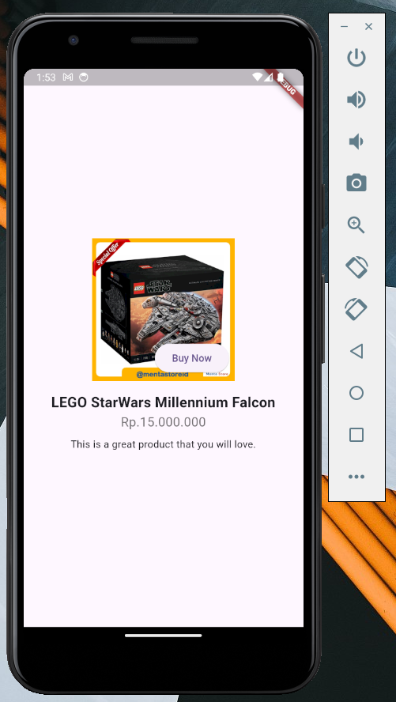

## Case Study 2: E-commerce Product Page



<br>

**Description:**
Develop a simple product page for an e-commerce app. Each product should have a large image at the top, a product name, price, and description, with a “Buy Now” button overlayed on top of the product image.

**Implementation:**

- **`Column`**: Used to structure the product image, name, price, and description vertically.
- **`Stack`**: Used to overlay the “Buy Now” button on top of the product image for quick purchase access.

<br>

**Code Snippets (Medium) 🧩**

```dart
import 'package:flutter/material.dart';

class CaseStudy2 extends StatelessWidget {
  const CaseStudy2({super.key});

  @override
  Widget build(BuildContext context) {
    return Center(
      child: Column(
        // TODO: The alignment here doesn't match the expected outcome. Can you fix it?
        mainAxisAlignment: MainAxisAlignment.start,
        crossAxisAlignment: CrossAxisAlignment.start,
        children: [
          // TODO: Add a Stack for the product image and "Buy Now" button here
          // TODO: Add Text widgets for product name, price, and description below
        ],
      ),
    );
  }
}
```

```dart
Stack(
  alignment: Alignment.bottomRight,
  children: [
    Image.network(
      'your-product-url',
      height: 150,         // TODO: Incorrect height. Can you find the right value?
      fit: BoxFit.contain, // TODO: This doesn’t quite fit the design! Try adjusting it.
    ),
    // TODO: Position the "Buy Now" button at the bottom right corner of the image
  ],
),
```

```dart
Positioned(
  bottom: 20,              // TODO: Incorrect alignment. Can you adjust it?
  right: 20,               // TODO: This doesn’t quite align the button correctly.
  child: ElevatedButton(
    onPressed: () {},
    child: const Text('Buy Now'),
  ),
),
```

```dart
const SizedBox(height: 16),
const Text(
  'Your Product Name',
  textAlign: TextAlign.start, // TODO: This doesn’t center-align the text. Can you fix it?
  style: TextStyle(fontSize: 16, fontWeight: FontWeight.normal), // TODO: Style seems off. Can you find the correct values?
),
const Text(
  'Rp. Your Product Price',
  style: TextStyle(fontSize: 14, color: Colors.grey), // TODO: This doesn’t match the design!
),
```

```dart
const Padding(
  padding: EdgeInsets.all(16.0), // TODO: Padding is a bit too wide. Can you adjust it?
  child: Text(
    'This is a great product that you will love.',
    textAlign: TextAlign.center,
  ),
),
```
