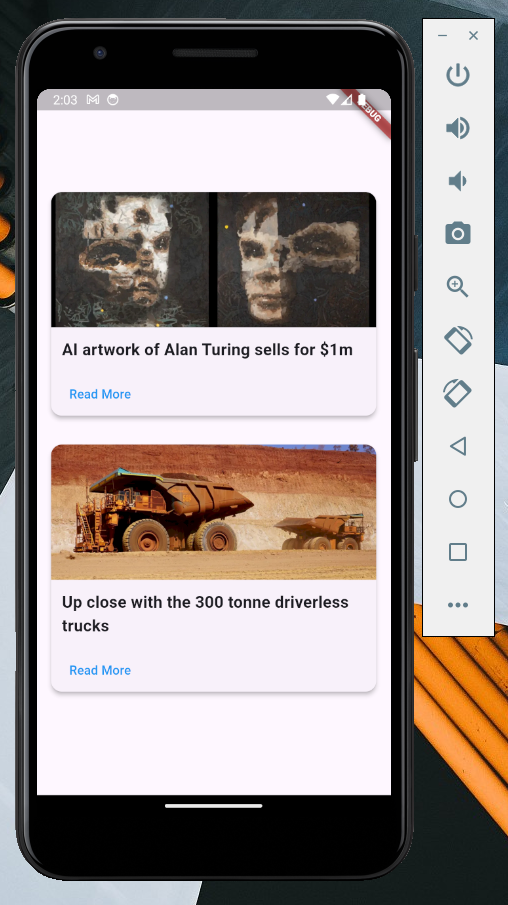

## Case Study 3: News App Home Page



<br>

**Description:**
Create a home page for a news app that displays two main headlines at the top, followed by several additional news articles. Each article should feature a title, image, and a “Read More” button.

**Implementation:**

- **`Column`**: Used to organize news items vertically.
- **`Row`**: Used to align the two main headlines side by side horizontally.

<br>

**Code Fragments (Hard) 🧩**

```dart
import 'package:flutter/material.dart';

class CaseStudy3 extends StatelessWidget {
  const CaseStudy3({super.key});

  @override
  Widget build(BuildContext context) {
    return const Center(
      child: Column(
        mainAxisAlignment: MainAxisAlignment.center,
        children: [
          // TODO: Add a NewsCard widget here
          // HINT: Use `NewsCard` with a title and imageUrl for each news article

          // TODO: Add a SizedBox with height: 16 for spacing

          // TODO: Add a second NewsCard widget here
        ],
      ),
    );
  }
}
```

```dart
class NewsCard extends StatelessWidget {
  final String title;
  final String imageUrl;

  const NewsCard({super.key, required this.title, required this.imageUrl});

  @override
  Widget build(BuildContext context) {
    return Card(
      // TODO: Add elevation for a slight shadow effect
      // HINT: Use `elevation: 4` for a balanced shadow

      // TODO: Set shape for rounded corners
      // HINT: Use `RoundedRectangleBorder` with `BorderRadius.circular(12)`

      // TODO: Add margin to give space around each NewsCard
      // HINT: Try `EdgeInsets.symmetric(horizontal: 16, vertical: 8)` for the margin

      child: Column(
        crossAxisAlignment: CrossAxisAlignment.start,
        children: [
          // TODO: Add an image and a Text widget for the news title
        ],
      ),
    );
  }
}
```

```dart
ClipRRect(
  // TODO: Add borderRadius to clip the top corners of the image
  // HINT: Use `BorderRadius.only(topLeft: Radius.circular(12), topRight: Radius.circular(12))`
  borderRadius: const BorderRadius.only(
    topLeft: Radius.circular(12),
    topRight: Radius.circular(12),
  ),
  child: Image.network(
    imageUrl,
    // TODO: Adjust image height, width, and fit to cover the card width and maintain aspect ratio
    // HINT: Use `height: 150`, `width: double.infinity`, and `fit: BoxFit.cover`
  ),
),
```

```dart
Padding(
  padding: const EdgeInsets.all(12.0),
  child: Text(
    title,
    // TODO: Style the text for better readability
    // HINT: Use `fontSize: 18` and `fontWeight: FontWeight.bold` to make the title stand out
  ),
),
```

```dart
Padding(
  padding: const EdgeInsets.symmetric(horizontal: 12),
  child: TextButton(
    onPressed: () {},
    // TODO: Style the button with a foreground color and padding
    // HINT: Use `foregroundColor: Colors.blue` and `padding: EdgeInsets.all(8.0)`
    child: const Text('Read More'),
  ),
),
```
