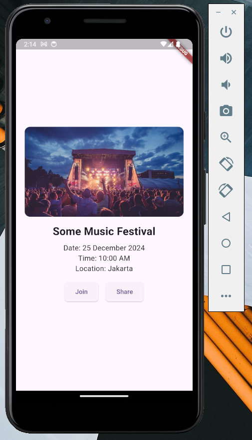

### Case Study 4: Event Details Page

 

**Description:**
Create an event detail page that features an event image at the top, followed by the event name, date, time, and location. Include “Join” and “Share” buttons at the bottom for user interaction.

**Implementation:**

- **`Column`**: Used to organize the event image, name, date, and other event details vertically.
- **`Row`**: Used to align the “Join” and “Share” buttons horizontally at the bottom.

 

**Code Snippets? 🧩**
 
There are no code snippets, you can try it yourself 😂🫵🏻

